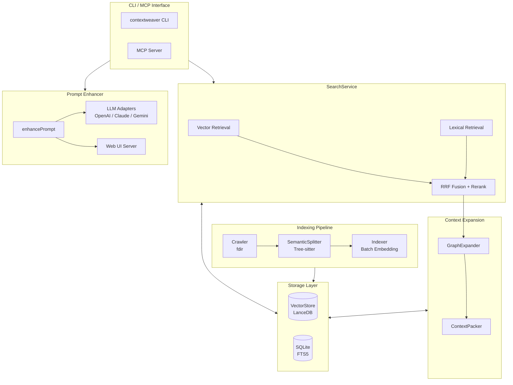

# ContextWeaver

<p align="center">
  <strong>🧵 A Context Weaving Engine for AI Agents</strong>
</p>

<p align="center">
  <em>Semantic Code Retrieval for AI Agents — Hybrid Search • Graph Expansion • Token-Aware Packing • Prompt Enhancer</em>
</p>

<p align="center">
  English | <a href="./README.md">中文</a>
</p>

---

> **Fork Note**: This project is forked from [hsingjui/ContextWeaver](https://github.com/hsingjui/ContextWeaver), with the addition of a **Prompt Enhancer** feature supporting OpenAI / Claude / Gemini multi-LLM endpoints, CLI commands, and Web UI interaction.

**ContextWeaver** is a semantic retrieval engine designed for AI coding assistants. It uses hybrid search (vector + lexical), intelligent context expansion, and token-aware packing to provide precise, relevant, and context-complete code snippets for LLMs.

<p align="center">
  
</p>

## ✨ Key Features

### 🔍 Hybrid Retrieval Engine
- **Vector Retrieval**: Deep understanding via semantic similarity
- **Lexical Retrieval (FTS)**: Exact matching of function names, class names, and technical terms
- **RRF Fusion (Reciprocal Rank Fusion)**: Intelligent fusion of multi-path recall results

### 🧠 AST-Based Semantic Chunking
- **Tree-sitter Parsing**: Supports TypeScript, JavaScript, Python, Go, Java, Rust, C, C++, C# — 9 languages
- **Dual-Text Strategy**: `displayCode` for display, `vectorText` for embedding
- **Gap-Aware Merging**: Smart handling of code gaps while preserving semantic integrity
- **Breadcrumb Injection**: Hierarchical path in vector text improves retrieval recall

### 📊 Three-Phase Context Expansion
- **E1 Neighbor Expansion**: Adjacent chunks in the same file for code block completeness
- **E2 Breadcrumb Completion**: Other methods under the same class/function for structural understanding
- **E3 Import Resolution**: Cross-file dependency tracking (configurable)

### 🎯 Smart TopK Cutoff
- **Anchor & Floor**: Dynamic threshold + absolute lower bound
- **Delta Guard**: Prevents misjudgment in Top1 outlier scenarios
- **Safe Harbor**: First N results only check the lower bound, ensuring basic recall

### 🔌 Native MCP Support
- **MCP Server Mode**: One-click launch of Model Context Protocol server
- **Zen Design**: Intent-term separation, LLM-friendly API design
- **Auto-Indexing**: First query triggers indexing automatically, incremental updates are transparent

### ✏️ Prompt Enhancer
- **Multi-LLM Support**: Switch between OpenAI / Claude / Gemini with one config
- **Three Interaction Modes**: MCP tool call, CLI command, Web UI browser interaction
- **Auto Language Detection**: Chinese input automatically gets Chinese output
- **Custom Templates**: Support for custom enhancement prompt templates

## 📦 Quick Start

### Requirements

- Node.js >= 20
- pnpm (recommended) or npm

### Installation

```bash
# Global install (enhanced version with Prompt Enhancer)
npm install -g @lyy0709/contextweaver

# Or using pnpm
pnpm add -g @lyy0709/contextweaver
```

### Initialize Configuration

```bash
# Create config file (~/.contextweaver/.env)
contextweaver init
# Or shorthand
cw init
```

Edit `~/.contextweaver/.env` and fill in your API keys:

```bash
# Embedding API (required)
EMBEDDINGS_API_KEY=your-api-key-here
EMBEDDINGS_BASE_URL=https://api.siliconflow.cn/v1/embeddings
EMBEDDINGS_MODEL=BAAI/bge-m3
EMBEDDINGS_MAX_CONCURRENCY=10
EMBEDDINGS_DIMENSIONS=1024

# Reranker (required)
RERANK_API_KEY=your-api-key-here
RERANK_BASE_URL=https://api.siliconflow.cn/v1/rerank
RERANK_MODEL=BAAI/bge-reranker-v2-m3
RERANK_TOP_N=20

# Ignore patterns (optional, comma-separated)
# IGNORE_PATTERNS=.venv,node_modules

# Prompt Enhancer (optional, required when using enhance / enhance-prompt)
# PROMPT_ENHANCER_ENDPOINT=openai          # Endpoint: openai / claude / gemini
# PROMPT_ENHANCER_BASE_URL=                # Custom API URL (for proxies, etc.)
# PROMPT_ENHANCER_TOKEN=your-api-key-here  # API key (required for enhance)
# PROMPT_ENHANCER_MODEL=                   # Custom model override
# PROMPT_ENHANCER_TEMPLATE=                # Custom template file path
```

### Index a Codebase

```bash
# Index current directory
contextweaver index

# Index a specific path
contextweaver index /path/to/your/project

# Force re-index
contextweaver index --force
```

### Local Search

```bash
# Semantic search
cw search --information-request "How is user authentication implemented?"

# With exact terms
cw search --information-request "Database connection logic" --technical-terms "DatabasePool,Connection"
```

### Prompt Enhancement

<p align="center">
  
</p>

```bash
# Launch Web UI for interactive editing (default)
cw enhance "Implement a cached semantic search"

# Direct output to stdout
cw enhance "Implement a cached semantic search" --no-browser

# Specify endpoint temporarily (openai/claude/gemini)
cw enhance "Implement a cached semantic search" --endpoint claude --no-browser
```

### Start MCP Server

```bash
# Start MCP server (for Claude and other AI assistants)
contextweaver mcp
```

## 🔧 MCP Integration

### Claude Desktop / Claude Code Configuration

Add to your config file:

```json
{
  "mcpServers": {
    "contextweaver": {
      "command": "contextweaver",
      "args": ["mcp"]
    }
  }
}
```

### MCP Tools

ContextWeaver provides two MCP tools:

- `codebase-retrieval`: Codebase search (primary tool)
- `enhance-prompt`: Prompt enhancement (optional, requires external LLM API config)

#### `codebase-retrieval` Parameters

| Parameter | Type | Required | Description |
|-----------|------|----------|-------------|
| `repo_path` | string | ✅ | Absolute path to the repository root |
| `information_request` | string | ✅ | Semantic intent in natural language |
| `technical_terms` | string[] | ❌ | Exact technical terms (class names, function names, etc.) |

#### Zen Design Philosophy

- **Intent-Term Separation**: `information_request` describes "what to do", `technical_terms` filters "what it's called"
- **Golden Defaults**: Provides same-file context, no cross-file crawling by default
- **Agent Autonomy**: The tool only locates; cross-file exploration is driven by the Agent

#### `enhance-prompt` Parameters

| Parameter | Type | Required | Description |
|-----------|------|----------|-------------|
| `prompt` | string | ✅ | The original prompt to enhance |
| `conversation_history` | string | ❌ | Conversation history (`User: ...\nAssistant: ...`) |
| `project_root_path` | string | ❌ | Project root path for context |

#### Prompt Enhancer Endpoint Defaults

| Endpoint | Default Base URL | Default Model |
|----------|-----------------|---------------|
| `openai` | `https://api.openai.com/v1/chat/completions` | `gpt-4o-mini` |
| `claude` | `https://api.anthropic.com/v1/messages` | `claude-sonnet-4-20250514` |
| `gemini` | `https://generativelanguage.googleapis.com/v1beta` | `gemini-2.0-flash` |

## 🏗️ Architecture



### Core Modules

| Module | Responsibility |
|--------|---------------|
| **SearchService** | Hybrid search core: vector/lexical recall, RRF fusion, reranking |
| **GraphExpander** | Context expander: E1/E2/E3 three-phase expansion |
| **ContextPacker** | Context packer: paragraph merging and token budget control |
| **VectorStore** | LanceDB adapter: vector index CRUD |
| **SQLite (FTS5)** | Metadata storage + full-text search index |
| **SemanticSplitter** | AST semantic chunker based on Tree-sitter |
| **Prompt Enhancer** | Prompt enhancement: multi-LLM adapters, Web UI interaction |

## 📁 Project Structure

```
contextweaver/
├── src/
│   ├── index.ts              # CLI entry point
│   ├── config.ts             # Configuration (environment variables)
│   ├── api/                  # External API clients
│   │   ├── embed.ts          # Embedding API
│   │   └── rerank.ts         # Reranker API
│   ├── chunking/             # Semantic chunking
│   │   ├── SemanticSplitter.ts   # AST semantic chunker
│   │   ├── SourceAdapter.ts      # Source adapter
│   │   ├── LanguageSpec.ts       # Language specifications
│   │   └── ParserPool.ts        # Tree-sitter parser pool
│   ├── scanner/              # File scanning
│   ├── indexer/              # Indexing
│   ├── vectorStore/          # Vector storage (LanceDB)
│   ├── db/                   # Database (SQLite + FTS5)
│   ├── search/               # Search service
│   │   ├── SearchService.ts  # Core search service
│   │   ├── GraphExpander.ts  # Context expander
│   │   ├── ContextPacker.ts  # Context packer
│   │   └── resolvers/        # Multi-language import resolvers
│   ├── enhancer/             # Prompt Enhancer
│   │   ├── index.ts          # Enhancement orchestration
│   │   ├── template.ts       # Template management
│   │   ├── detect.ts         # Language detection
│   │   ├── parser.ts         # Response parsing
│   │   ├── llmClient.ts      # LLM client interface + factory
│   │   ├── server.ts         # Web UI HTTP server
│   │   ├── ui.ts             # Frontend page template
│   │   ├── browser.ts        # Browser launcher
│   │   └── adapters/         # LLM API adapters
│   │       ├── openai.ts
│   │       ├── claude.ts
│   │       └── gemini.ts
│   ├── mcp/                  # MCP server
│   │   ├── server.ts         # MCP server implementation
│   │   ├── main.ts           # MCP entry point
│   │   └── tools/
│   │       ├── codebaseRetrieval.ts  # Code retrieval tool
│   │       └── enhancePrompt.ts      # Prompt enhancement tool
│   └── utils/                # Utilities
│       └── logger.ts         # Logging system
├── tests/                    # Unit tests
├── package.json
├── tsconfig.json
└── vitest.config.ts
```

## ⚙️ Configuration Reference

### Environment Variables

| Variable | Required | Default | Description |
|----------|----------|---------|-------------|
| `EMBEDDINGS_API_KEY` | ✅ | - | Embedding API key |
| `EMBEDDINGS_BASE_URL` | ✅ | - | Embedding API URL |
| `EMBEDDINGS_MODEL` | ✅ | - | Embedding model name |
| `EMBEDDINGS_MAX_CONCURRENCY` | ❌ | 10 | Embedding concurrency |
| `EMBEDDINGS_DIMENSIONS` | ❌ | 1024 | Vector dimensions |
| `RERANK_API_KEY` | ✅ | - | Reranker API key |
| `RERANK_BASE_URL` | ✅ | - | Reranker API URL |
| `RERANK_MODEL` | ✅ | - | Reranker model name |
| `RERANK_TOP_N` | ❌ | 20 | Rerank return count |
| `IGNORE_PATTERNS` | ❌ | - | Extra ignore patterns |
| `PROMPT_ENHANCER_ENDPOINT` | ❌ | `openai` | Enhancer endpoint (openai/claude/gemini) |
| `PROMPT_ENHANCER_TOKEN` | ❌* | - | Enhancer API key (*required when using enhance) |
| `PROMPT_ENHANCER_BASE_URL` | ❌ | per endpoint | Custom enhancer API URL |
| `PROMPT_ENHANCER_MODEL` | ❌ | per endpoint | Custom enhancer model |
| `PROMPT_ENHANCER_TEMPLATE` | ❌ | - | Custom enhancer template path |

## 🌍 Language Support

ContextWeaver natively supports AST parsing for the following languages via Tree-sitter:

| Language | AST Parsing | Import Resolution | File Extensions |
|----------|-------------|-------------------|-----------------|
| TypeScript | ✅ | ✅ | `.ts`, `.tsx` |
| JavaScript | ✅ | ✅ | `.js`, `.jsx`, `.mjs` |
| Python | ✅ | ✅ | `.py` |
| Go | ✅ | ✅ | `.go` |
| Java | ✅ | ✅ | `.java` |
| Rust | ✅ | ✅ | `.rs` |
| C | ✅ | ✅ | `.c`, `.h` |
| C++ | ✅ | ✅ | `.cpp`, `.hpp`, `.cc`, `.cxx` |
| C# | ✅ | ✅ | `.cs` |

Other languages use a line-based fallback chunking strategy and can still be indexed and searched.

## 📊 Performance

- **Incremental Indexing**: Only processes changed files, 10x+ speedup on re-index
- **Batch Embedding**: Adaptive batch sizing with concurrency control
- **Rate Limit Recovery**: Auto-backoff on 429 errors with progressive recovery
- **Connection Pooling**: Tree-sitter parser pool reuse
- **File Index Cache**: GraphExpander file path index lazy loading

## 🧪 Testing

```bash
# Run tests
pnpm test

# Watch mode
pnpm test:watch
```

## 🐛 Logging & Debugging

Log file location: `~/.contextweaver/logs/app.YYYY-MM-DD.log`

Set log level:

```bash
# Enable debug logging
LOG_LEVEL=debug contextweaver search --information-request "..."
```

## 📄 License

This project is licensed under the MIT License.

## 🙏 Acknowledgments

- [hsingjui/ContextWeaver](https://github.com/hsingjui/ContextWeaver) — Original project
- [Tree-sitter](https://tree-sitter.github.io/tree-sitter/) — High-performance syntax parsing
- [LanceDB](https://lancedb.com/) — Embedded vector database
- [MCP](https://modelcontextprotocol.io/) — Model Context Protocol
- [SiliconFlow](https://siliconflow.cn/) — Recommended Embedding/Reranker API provider

---

<p align="center">
  <sub>Made with ❤️ for AI-assisted coding</sub>
</p>
