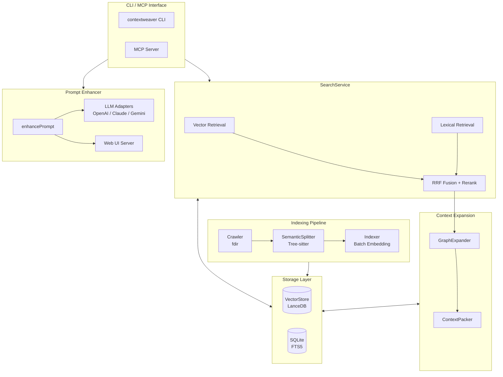

# ContextWeaver

<p align="center">
  <strong>🧵 为 AI Agent 精心编织的代码库上下文引擎</strong>
</p>

<p align="center">
  <em>Semantic Code Retrieval for AI Agents — Hybrid Search • Graph Expansion • Token-Aware Packing • Prompt Enhancer</em>
</p>

<p align="center">
  <a href="./README.en.md">English</a> | 中文
</p>

---

> **Fork 说明**：本项目 fork 自 [hsingjui/ContextWeaver](https://github.com/hsingjui/ContextWeaver)，新增了 **Prompt Enhancer（提示词增强）** 功能，支持 OpenAI / Claude / Gemini 多 LLM 端点、CLI 命令行、Web UI 交互三种使用方式。

**ContextWeaver** 是一个专为 AI 代码助手设计的语义检索引擎，采用混合搜索（向量 + 词法）、智能上下文扩展和 Token 感知打包策略，为 LLM 提供精准、相关且上下文完整的代码片段。

<p align="center">
  
</p>

## ✨ 核心特性

### 🔍 混合检索引擎
- **向量召回 (Vector Retrieval)**：基于语义相似度的深度理解
- **词法召回 (Lexical/FTS)**：精确匹配函数名、类名等技术术语
- **RRF 融合 (Reciprocal Rank Fusion)**：智能融合多路召回结果

### 🧠 AST 语义分片
- **Tree-sitter 解析**：支持 TypeScript、JavaScript、Python、Go、Java、Rust、C、C++、C# 九大语言
- **Dual-Text 策略**：`displayCode` 用于展示，`vectorText` 用于 Embedding
- **Gap-Aware 合并**：智能处理代码间隙，保持语义完整性
- **Breadcrumb 注入**：向量文本包含层级路径，提升检索召回率

### 📊 三阶段上下文扩展
- **E1 邻居扩展**：同文件前后相邻 chunks，保证代码块完整性
- **E2 面包屑补全**：同一类/函数下的其他方法，理解整体结构
- **E3 Import 解析**：跨文件依赖追踪（可配置开关）

### 🎯 智能截断策略 (Smart TopK)
- **Anchor & Floor**：动态阈值 + 绝对下限双保险
- **Delta Guard**：防止 Top1 outlier 场景的误判
- **Safe Harbor**：前 N 个结果只检查下限，保证基本召回

### 🔌 MCP 原生支持
- **MCP Server 模式**：一键启动 Model Context Protocol 服务端
- **Zen Design 理念**：意图与术语分离，LLM 友好的 API 设计
- **自动索引**：首次查询自动触发索引，增量更新透明无感

### ✏️ Prompt Enhancer（提示词增强）
- **多 LLM 支持**：OpenAI / Claude / Gemini 一键切换
- **三种交互方式**：MCP 工具调用、CLI 命令行、Web UI 浏览器交互
- **自动语言检测**：中文输入自动用中文回复
- **可自定义模板**：支持自定义增强提示词模板

## 📦 快速开始

### 环境要求

- Node.js >= 20
- pnpm (推荐) 或 npm

### 安装

```bash
# 全局安装（带 Prompt Enhancer 的增强版）
npm install -g @lyy0709/contextweaver

# 或使用 pnpm
pnpm add -g @lyy0709/contextweaver
```

### 初始化配置

```bash
# 初始化配置文件（创建 ~/.contextweaver/.env）
contextweaver init
# 或简写
cw init
```

编辑 `~/.contextweaver/.env`，填入你的 API Key：

```bash
# Embedding API 配置（必需）
EMBEDDINGS_API_KEY=your-api-key-here
EMBEDDINGS_BASE_URL=https://api.siliconflow.cn/v1/embeddings
EMBEDDINGS_MODEL=BAAI/bge-m3
EMBEDDINGS_MAX_CONCURRENCY=10
EMBEDDINGS_DIMENSIONS=1024

# Reranker 配置（必需）
RERANK_API_KEY=your-api-key-here
RERANK_BASE_URL=https://api.siliconflow.cn/v1/rerank
RERANK_MODEL=BAAI/bge-reranker-v2-m3
RERANK_TOP_N=20

# 忽略模式（可选，逗号分隔）
# IGNORE_PATTERNS=.venv,node_modules

# Prompt Enhancer 配置（可选，使用 enhance / enhance-prompt 时需要）
# PROMPT_ENHANCER_ENDPOINT=openai          # 端点：openai / claude / gemini
# PROMPT_ENHANCER_BASE_URL=                # 自定义 API 地址（代理等场景）
# PROMPT_ENHANCER_TOKEN=your-api-key-here  # API 密钥（必填）
# PROMPT_ENHANCER_MODEL=                   # 自定义模型
# PROMPT_ENHANCER_TEMPLATE=                # 自定义增强模板文件路径
```

### 索引代码库

```bash
# 在代码库根目录执行
contextweaver index

# 指定路径
contextweaver index /path/to/your/project

# 强制重新索引
contextweaver index --force
```

### 本地搜索

```bash
# 语义搜索
cw search --information-request "用户认证流程是如何实现的？"

# 带精确术语
cw search --information-request "数据库连接逻辑" --technical-terms "DatabasePool,Connection"
```

### 提示词增强

<p align="center">
  
</p>

```bash
# 默认启动 Web UI 交互式编辑
cw enhance "帮我实现一个带缓存的语义搜索"

# 直接输出到 stdout
cw enhance "帮我实现一个带缓存的语义搜索" --no-browser

# 临时指定端点（openai/claude/gemini）
cw enhance "帮我实现一个带缓存的语义搜索" --endpoint claude --no-browser
```

### 启动 MCP 服务器

```bash
# 启动 MCP 服务端（供 Claude 等 AI 助手使用）
contextweaver mcp
```

## 🔧 MCP 集成配置

### Claude Desktop / Claude Code 配置

在配置文件中添加：

```json
{
  "mcpServers": {
    "contextweaver": {
      "command": "contextweaver",
      "args": ["mcp"]
    }
  }
}
```

### MCP 工具说明

ContextWeaver 提供两个 MCP 工具：

- `codebase-retrieval`：代码库检索（主工具）
- `enhance-prompt`：提示词增强（可选，需要额外配置外部 LLM API）

#### `codebase-retrieval` 参数说明

| 参数 | 类型 | 必需 | 描述 |
|------|------|------|------|
| `repo_path` | string | ✅ | 代码库根目录的绝对路径 |
| `information_request` | string | ✅ | 自然语言形式的语义意图描述 |
| `technical_terms` | string[] | ❌ | 精确技术术语（类名、函数名等） |

#### 设计理念 (Zen Design)

- **意图与术语分离**：`information_request` 描述「做什么」，`technical_terms` 过滤「叫什么」
- **黄金默认值**：提供同文件上下文，禁止默认跨文件抓取
- **回归代理本能**：工具只负责定位，跨文件探索由 Agent 自主发起

#### `enhance-prompt` 参数说明

| 参数 | 类型 | 必需 | 描述 |
|------|------|------|------|
| `prompt` | string | ✅ | 原始提示词 |
| `conversation_history` | string | ❌ | 对话历史（格式：`User: ...\nAssistant: ...`） |
| `project_root_path` | string | ❌ | 项目根目录路径 |

#### Prompt Enhancer 端点默认值

| 端点 | 默认 Base URL | 默认模型 |
|------|--------------|---------|
| `openai` | `https://api.openai.com/v1/chat/completions` | `gpt-4o-mini` |
| `claude` | `https://api.anthropic.com/v1/messages` | `claude-sonnet-4-20250514` |
| `gemini` | `https://generativelanguage.googleapis.com/v1beta` | `gemini-2.0-flash` |

## 🏗️ 架构设计



### 核心模块说明

| 模块 | 职责 |
|------|------|
| **SearchService** | 混合搜索核心，协调向量/词法召回、RRF 融合、Rerank 精排 |
| **GraphExpander** | 上下文扩展器，执行 E1/E2/E3 三阶段扩展策略 |
| **ContextPacker** | 上下文打包器，负责段落合并和 Token 预算控制 |
| **VectorStore** | LanceDB 适配层，管理向量索引的增删改查 |
| **SQLite (FTS5)** | 元数据存储 + 全文搜索索引 |
| **SemanticSplitter** | AST 语义分片器，基于 Tree-sitter 解析 |
| **Prompt Enhancer** | 提示词增强，多 LLM 适配，Web UI 交互 |

## 📁 项目结构

```
contextweaver/
├── src/
│   ├── index.ts              # CLI 入口
│   ├── config.ts             # 配置管理（环境变量）
│   ├── api/                  # 外部 API 封装
│   │   ├── embed.ts          # Embedding API
│   │   └── rerank.ts         # Reranker API
│   ├── chunking/             # 语义分片
│   │   ├── SemanticSplitter.ts   # AST 语义分片器
│   │   ├── SourceAdapter.ts      # 源码适配器
│   │   ├── LanguageSpec.ts       # 语言规范定义
│   │   └── ParserPool.ts        # Tree-sitter 解析器池
│   ├── scanner/              # 文件扫描
│   │   ├── crawler.ts        # 文件系统遍历
│   │   ├── processor.ts      # 文件处理
│   │   └── filter.ts         # 过滤规则
│   ├── indexer/              # 索引器
│   │   └── index.ts          # 批量索引逻辑
│   ├── vectorStore/          # 向量存储
│   │   └── index.ts          # LanceDB 适配层
│   ├── db/                   # 数据库
│   │   └── index.ts          # SQLite + FTS5
│   ├── search/               # 搜索服务
│   │   ├── SearchService.ts  # 核心搜索服务
│   │   ├── GraphExpander.ts  # 上下文扩展器
│   │   ├── ContextPacker.ts  # 上下文打包器
│   │   ├── fts.ts            # 全文搜索
│   │   ├── config.ts         # 搜索配置
│   │   ├── types.ts          # 类型定义
│   │   └── resolvers/        # 多语言 Import 解析器
│   ├── enhancer/             # Prompt Enhancer（提示词增强）
│   │   ├── index.ts          # 增强服务编排
│   │   ├── template.ts       # 模板管理
│   │   ├── detect.ts         # 语言检测
│   │   ├── parser.ts         # 响应解析
│   │   ├── llmClient.ts      # LLM 客户端接口 + 工厂
│   │   ├── server.ts         # Web UI HTTP 服务器
│   │   ├── ui.ts             # 前端页面模板
│   │   ├── browser.ts        # 浏览器启动
│   │   └── adapters/         # LLM API 适配器
│   │       ├── openai.ts
│   │       ├── claude.ts
│   │       └── gemini.ts
│   ├── mcp/                  # MCP 服务端
│   │   ├── server.ts         # MCP 服务器实现
│   │   ├── main.ts           # MCP 入口
│   │   └── tools/
│   │       ├── codebaseRetrieval.ts  # 代码检索工具
│   │       └── enhancePrompt.ts      # 提示词增强工具
│   └── utils/                # 工具函数
│       └── logger.ts         # 日志系统
├── tests/                    # 单元测试
├── package.json
├── tsconfig.json
└── vitest.config.ts
```

## ⚙️ 配置详解

### 环境变量

| 变量名 | 必需 | 默认值 | 描述 |
|--------|------|--------|------|
| `EMBEDDINGS_API_KEY` | ✅ | - | Embedding API 密钥 |
| `EMBEDDINGS_BASE_URL` | ✅ | - | Embedding API 地址 |
| `EMBEDDINGS_MODEL` | ✅ | - | Embedding 模型名称 |
| `EMBEDDINGS_MAX_CONCURRENCY` | ❌ | 10 | Embedding 并发数 |
| `EMBEDDINGS_DIMENSIONS` | ❌ | 1024 | 向量维度 |
| `RERANK_API_KEY` | ✅ | - | Reranker API 密钥 |
| `RERANK_BASE_URL` | ✅ | - | Reranker API 地址 |
| `RERANK_MODEL` | ✅ | - | Reranker 模型名称 |
| `RERANK_TOP_N` | ❌ | 20 | Rerank 返回数量 |
| `IGNORE_PATTERNS` | ❌ | - | 额外忽略模式 |
| `PROMPT_ENHANCER_ENDPOINT` | ❌ | `openai` | 增强端点（openai/claude/gemini） |
| `PROMPT_ENHANCER_TOKEN` | ❌* | - | 增强 API 密钥（*使用 enhance 时必填） |
| `PROMPT_ENHANCER_BASE_URL` | ❌ | 按端点 | 自定义增强 API 地址 |
| `PROMPT_ENHANCER_MODEL` | ❌ | 按端点 | 自定义增强模型 |
| `PROMPT_ENHANCER_TEMPLATE` | ❌ | - | 自定义增强模板路径 |

### 搜索配置参数

```typescript
interface SearchConfig {
  // === 召回阶段 ===
  vectorTopK: number;        // 向量召回数量（默认 30）
  vectorTopM: number;        // 送入融合的向量结果数（默认 30）
  ftsTopKFiles: number;      // FTS 召回文件数（默认 15）
  lexChunksPerFile: number;  // 每文件词法 chunks 数（默认 3）
  lexTotalChunks: number;    // 词法总 chunks 数（默认 30）

  // === 融合阶段 ===
  rrfK0: number;             // RRF 平滑常数（默认 60）
  wVec: number;              // 向量权重（默认 1.0）
  wLex: number;              // 词法权重（默认 0.5）
  fusedTopM: number;         // 融合后送 rerank 数量（默认 40）

  // === Rerank ===
  rerankTopN: number;        // Rerank 后保留数量（默认 10）
  maxRerankChars: number;    // Rerank 文本最大字符数（默认 1200）

  // === 扩展策略 ===
  neighborHops: number;      // E1 邻居跳数（默认 2）
  breadcrumbExpandLimit: number;  // E2 面包屑补全数（默认 3）
  importFilesPerSeed: number;     // E3 每 seed 导入文件数（默认 0）
  chunksPerImportFile: number;    // E3 每导入文件 chunks（默认 0）

  // === Smart TopK ===
  enableSmartTopK: boolean;  // 启用智能截断（默认 true）
  smartTopScoreRatio: number;     // 动态阈值比例（默认 0.5）
  smartMinScore: number;          // 绝对下限（默认 0.25）
  smartMinK: number;              // Safe Harbor 数量（默认 2）
  smartMaxK: number;              // 硬上限（默认 15）
}
```

## 🌍 多语言支持

ContextWeaver 通过 Tree-sitter 原生支持以下编程语言的 AST 解析：

| 语言 | AST 解析 | Import 解析 | 文件扩展名 |
|------|----------|-------------|-----------|
| TypeScript | ✅ | ✅ | `.ts`, `.tsx` |
| JavaScript | ✅ | ✅ | `.js`, `.jsx`, `.mjs` |
| Python | ✅ | ✅ | `.py` |
| Go | ✅ | ✅ | `.go` |
| Java | ✅ | ✅ | `.java` |
| Rust | ✅ | ✅ | `.rs` |
| C | ✅ | ✅ | `.c`, `.h` |
| C++ | ✅ | ✅ | `.cpp`, `.hpp`, `.cc`, `.cxx` |
| C# | ✅ | ✅ | `.cs` |

其他语言会采用基于行的 Fallback 分片策略，仍可正常索引和搜索。

## 🔄 工作流程

### 索引流程

```
1. Crawler     → 遍历文件系统，过滤忽略项
2. Processor   → 读取文件内容，计算 hash
3. Splitter    → AST 解析，语义分片
4. Indexer     → 批量 Embedding，写入向量库
5. FTS Index   → 更新全文搜索索引
```

### 搜索流程

```
1. Query Parse     → 解析查询，分离语义和术语
2. Hybrid Recall   → 向量 + 词法双路召回
3. RRF Fusion      → Reciprocal Rank Fusion 融合
4. Rerank          → 交叉编码器精排
5. Smart Cutoff    → 智能分数截断
6. Graph Expand    → 邻居/面包屑/导入扩展
7. Context Pack    → 段落合并，Token 预算
8. Format Output   → 格式化返回给 LLM
```

## 📊 性能特性

- **增量索引**：只处理变更文件，二次索引速度提升 10x+
- **批量 Embedding**：自适应批次大小，支持并发控制
- **速率限制恢复**：429 错误时自动退避，渐进恢复
- **连接池复用**：Tree-sitter 解析器池化复用
- **文件索引缓存**：GraphExpander 文件路径索引 lazy load

## 🧪 测试

```bash
# 运行测试
pnpm test

# 监听模式
pnpm test:watch
```

## 🐛 日志与调试

日志文件位置：`~/.contextweaver/logs/app.YYYY-MM-DD.log`

设置日志级别：

```bash
# 开启 debug 日志
LOG_LEVEL=debug contextweaver search --information-request "..."
```

## 📄 开源协议

本项目采用 MIT 许可证。

## 🙏 致谢

- [hsingjui/ContextWeaver](https://github.com/hsingjui/ContextWeaver) - 原始项目
- [Tree-sitter](https://tree-sitter.github.io/tree-sitter/) - 高性能语法解析
- [LanceDB](https://lancedb.com/) - 嵌入式向量数据库
- [MCP](https://modelcontextprotocol.io/) - Model Context Protocol
- [SiliconFlow](https://siliconflow.cn/) - 推荐的 Embedding/Reranker API 服务

---

<p align="center">
  <sub>Made with ❤️ for AI-assisted coding</sub>
</p>
